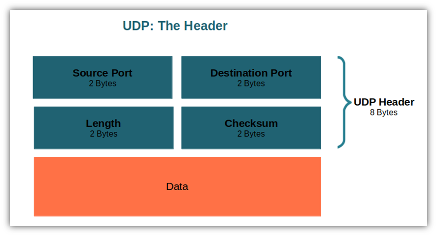

Welcome to my repository! 👋

This project is the result of my studies on the OSI model and my attempt to build a UDP sender entirely on an FPGA. Although the implementation works, it's still in a proof-of-concept stage and requires several improvements before being considered production-ready.

⚠️ **Disclaimer:** I do not recommend using this Intellectual Property (IP) in a real-world application — it's very likely it won't work reliably. However, it can be a solid starting point to understand how Ethernet frames are built from scratch.

Feel free to explore, adapt, improve the design, or reach out via email if you have questions or suggestions!

# 🛠️ How to Build the Project

1. First, clone this repository:

        git clone https://github.com/alanldm/UDP-IP-Ethernet.git

2. Open `Vivado`. This project was developed using `Vivado 2019.1`, so I highly recommend using the same version to avoid compatibility issues.
3. In Vivado, go to `Tools > Run TCL Script`, and locate the file `UDP.tcl` that you just downloaded with the repository.
4. Run the script and wait until the project is fully generated and built.
5. Once the build is complete, you can generate the bitstream and load it on your FPGA board.

> ⚠️ **Important:** You may encounter issues if you're using a different version of Vivado or a different FPGA board.  
> To ensure compatibility:  
> • Stick to **Vivado 2019.1**, as used in this project.  
> • Adapt the **constraints file (.xdc)** to match your specific FPGA board.

# 🌐 The OSI Model

The **Open Systems Interconnection (OSI)** model is a standard developed by the International Organization for Standardization (ISO) to define how communication between multiple networked systems is structured. The complexity of communication depends on how many layers are involved in the process. It's important to note that each layer has its own responsibilities, objectives, and associated protocols. Depending on the protocol used, each layer may add a different header that must be properly constructed to establish successful communication. If these headers are incorrect or missing, network equipment such as **routers** and **switches**, or even your **Operating System (OS)**, may discard the packet entirely! The OSI model is divided into seven layers, as seen in the figure below.

    

> ⚠️ **Important:** For this project, we will focus only on the first four layers of the OSI model: **Physical**, **Data Link**, **Network**, and **Transport**.

## 🚥 Ethernet Protocol

Ethernet was developed in the early 1970s and is standardized under **ISO/IEC/IEEE 8802-3**. It is responsible for preparing the data frame to be sent over the physical channel, including interfaces such as **RJ-45**, **SFP**, and cables like **UTP** and **S/FTP**.

> 🚧 **Caution:** Depending on the communication speed you’re aiming for, I recommend paying close attention to the physical interfaces, as they can become a limiting factor.  
> Make sure to check the cable category **(CAT rating)**, as it directly impacts the maximum supported data rate.

Ethernet also handles synchronization between devices to establish a reliable link. This protocol spans **two layers** of the OSI model: the **Physical Layer** and the **Data Link Layer**. In the Data Link Layer, Ethernet is divided into two sublayers:
- **Logical Link Control (LLC)**
- **Media Access Control (MAC)**

The **Physical Layer** manages the transmission and reception of bits over physical media (electrical or optical). On the other hand, the **MAC sublayer** is responsible for building the Ethernet frame. This includes:
- The **Preamble**: a 7-byte sequence (`0x55`) to allow clock synchronization
- The **Start Frame Delimiter (SFD)**: 1 byte (`0xD5`) indicating the start of the actual frame
- The **Header**
- The **Payload**
- The **Trailer (CRC / Frame Check Sequence)** used for error detection

    

### ⚙️ Physical Layer

The physical layer can be challenging to work with because it deals directly with hardware — including voltage levels, electrical signaling, and physical connections.

This layer defines the characteristics of the communication bus, such as:
- **MII** (Media Independent Interface)
- **MDI** (Media Dependent Interface)
- **PCS** (Physical Coding Sublayer)
- **PMA** (Physical Medium Attachment)
- **PMD** (Physical Medium Dependent)

    

All of these components are tightly related to circuit design and low-level hardware implementation. So...

    

> 💀 **Don't worry** — someone has already done the dirty work. Due to the complexity of this layer, it's common to rely on dedicated chips to handle its functions. In this project, for example, I used the `Marvell 88E1512` PHY chip.

### 🧩 MAC Layer and Ethernet Header

As mentioned before, this part of the Ethernet protocol is responsible for building the Ethernet frame, which consists of the **header** (destination MAC address, source MAC address, and the encapsulated protocol type) and the **payload**. Therefore, the **preamble**, **Start Frame Delimiter (SFD)**, and the **trailer (CRC)** are **not** considered part of the frame itself — they are handled separately.

    

> 🆔 **The MAC address is a unique identifier** assigned to a network interface. It's essentially the ID of your hardware on the network!

A summary of the Ethernet frame structure is presented in the table below:

| Field                          | Size (Bytes) | Description                                                                |
|--------------------------------|--------------|----------------------------------------------------------------------------|
| **Destination MAC**            | 6            | MAC address of the receiving device.                                       |
| **Source MAC**                 | 6            | MAC address of the sending device.                                         |
| **EtherType**                  | 2            | Identifies the encapsulated protocol (e.g., 0x0800 for IPv4).              |
| **Payload (Data)**             | 46–1500      | Actual data being transmitted (may include IP, UDP, etc.).                 |
| **Frame Check Sequence (FCS)** | 4            | CRC for error checking (handled by hardware, not always shown manually).   |

> 📌 **Note:** As stated before, the **preamble** (7 bytes of `0x55`) and the **Start Frame Delimiter (1 byte `0xD5`)** precede this header but are not considered part of the frame header itself.

## 🌍 Internet Protocol (IP)

This protocol operates at the **third layer (Network Layer)** of the OSI model and serves as the foundation for communication between different networks. It typically encapsulates a higher-layer protocol, such as `UDP` or `TCP`, providing logical addressing and routing capabilities. An example of an Internet Protocol (IP) packet structure can be seen in the figure below.

    

Since I used IPv4 for this project, the structure of its packet header is summarized in the table below.

> 📌 **Note:** The minimum IPv4 header size is **20 bytes**. If options are included, it can grow up to **60 bytes**.

| Field                                | Size (Bytes) | Description                                                                 |
|-------------------------------------|---------------|-----------------------------------------------------------------------------|
| **Version + IHL**                   | 1             | 4 bits for version + 4 bits for header length.                              |
| **Type of Service (ToS)**           | 1             | Specifies packet priority and QoS handling.                                 |
| **Total Length**                    | 2             | Total size of the IP packet (header + data).                                |
| **Identification**                  | 2             | Identifies packet fragments for reassembly.                                 |
| **Flags + Fragment Offset**         | 2             | 3 bits for flags + 13 bits for fragment offset.                             |
| **Time To Live (TTL)**              | 1             | Max number of hops before packet is discarded.                              |
| **Protocol**                        | 1             | Indicates the protocol in the data (e.g., `17` for UDP).                      |
| **Header Checksum**                 | 2             | Checksum for error-checking the header.                                     |
| **Source IP Address**               | 4             | IP address of the sender.                                                   |
| **Destination IP Address**          | 4             | IP address of the receiver.                                                 |
| **Options + Padding (if present)**  | 0–40          | Optional.                                                                   |

> 🆔 **The IP address is an identifier** that acts like a postal code within a network. Unlike the MAC address, it can be changed or reassigned depending on the network configuration.

## 📦 User Datagram Protocol (UDP)

Finally, we arrive at the **UDP protocol** in the **Transport Layer**. UDP enables fast data transmission without the need for a prior connection or any guarantee of delivery, order, or integrity. Because of its simplicity and low overhead, UDP is ideal for scenarios where **speed matters more than reliability**. Its header is minimal — just 8 bytes — and is shown in the image below.

    

The table below provides a summary of the UDP protocol header.

| Field                  | Size (Bytes) | Description                                                                  |
|------------------------|---------------|-----------------------------------------------------------------------------|
| **Source Port**        | 2             | Port number of the sender application.                                      |
| **Destination Port**   | 2             | Port number of the receiving application.                                   |
| **Length**             | 2             | Total length of the UDP header and payload (in bytes).                      |
| **Checksum**           | 2             | Optional checksum for error-checking.                                       |

> 📌 **Note:** The UDP header is always **8 bytes** long. It does not include sequence numbers, acknowledgments, or retransmissions — that's what makes it lightweight.

# 💡 Proposed Solution

After this overview of the OSI model and the main protocols used in this project, I can now explain the core idea behind the implementation.

## ⚙️ Setup

The following topics provide a quick overview of the setup used in this project.

### 🔌 Hardware

- FMC Carrier V1 Rev. C  
- SoM PicoZed 7015 with Zynq-7000 SoC  
- FMC XM105 Debug Board Rev. B  
- S/FTP CAT 6A Cable  

> The interfaces used in this project are the `RJ45` connector for Ethernet communication and the `JTAG` interface available on the motherboard. To enable JTAG functionality, I integrated a `Digilent JTAG-HS3 Rev. A` programmer. There is also a clock signal provided by the debug board, generated by the **Si570** oscillator at **156.25 MHz**.

### 💻 Software

- **Vivado 2019.1** — for project synthesis and bitstream generation  
- **Wireshark** — to inspect and analyze the Ethernet/UDP packets  
- **socat** — to simulate UDP endpoints and assist in testing the communication

## Block Diagram

In the block diagram, you will find a mix of custom and pre-built IP blocks. My contribution focuses on three custom modules: `UDP`, `IP`, and `Ethernet`. The other components — including the `Clocking Wizard`, the `Tri-Mode Ethernet MAC`, and the `AXI4-Stream Data FIFO` — are standard IP cores provided by **Xilinx**.

    

> 💰 It’s worth noting that some of the IP cores used in this project are **licensed**. For example, during development I had to use the **free trial** of the **Tri-Mode Ethernet MAC** core from Xilinx. This IP manages the communication between the **Data Link** and **Physical** layers — in this case, connected to the **Marvell 88E1512** PHY chip. It is responsible for tasks such as inserting the **preamble** and **CRC** (FCS) into the Ethernet frame automatically. I also used the **Virtual Input/Output (VIO)** and **Integrated Logic Analyzer (ILA)** blocks for debugging purposes. These tools were essential for monitoring internal signals in real time and validating the behavior of the FSMs and data paths.

## Ethernet Layer

### 🧱 Ethernet Block

This block, implemented in VHDL, contains a finite state machine (FSM) responsible for sending the entire Ethernet frame **byte by byte** to the **AXI4-Stream Data FIFO** interface.

    

#### 🔁 Ethernet Interface Summary

The following table summarizes all input and output ports of the `ethernet_generator` block, along with their width and function.

| Signal Name     | Direction | Width (Bits)     | Description                                                                 |
|-----------------|-----------|------------------|-----------------------------------------------------------------------------|
| `clk`           | Input     | 1                | System clock                                                                |
| `rst`           | Input     | 1                | Reset signal (active low)                                                   |
| `prtcl_on_off`  | Input     | 1                | Network protocol block activity indicator during transmission.              |
| `prtcl_valid`   | Input     | 1                | Network protocol block valid signal (during the data transmission phase)    |
| `src_mac`       | Input     | 48               | Source MAC address                                                          |
| `dst_mac`       | Input     | 48               | Destination MAC address                                                     |
| `prtcl_type`    | Input     | 16               | Protocol type field (e.g., 0x0800 for IPv4)                                 |
| `data_in`       | Input     | 8                | Data byte from network protocol block                                       |
| `tready`        | Input     | 1                | AXI4-Stream: receiver ready signal                                          |
| `tdata`         | Output    | 8                | AXI4-Stream: byte to transmit                                               |
| `tvalid`        | Output    | 1                | AXI4-Stream: indicates valid `tdata`                                        |
| `tlast`         | Output    | 1                | AXI4-Stream: indicates the last byte of a frame                             |
| `prtcl_en`      | Output    | 1                | Signal to enable the network protocol block to start transmitting           |
| `start_dbg`     | Output    | 1                | Debug: high when transmission starts                                        |
| `state_dbg`     | Output    | 4                | Debug: current FSM state code                                               |
| `count_dbg`     | Output    | 6                | Debug: counter value for frame construction                                 |

#### 🧠 FSM State Encoding

| State Name        | Code (`state_dbg`) | Description                                               |
|-------------------|--------------------|-----------------------------------------------------------|
| `WAITING`         | `0001`             | Idle state, waiting for timer to expire                   |
| `START`           | `0010`             | Start of frame sequence                                   |
| `LOAD`            | `0011`             | Load MAC and protocol type values into internal registers |
| `DESTINATION_MAC` | `0100`             | Sending destination MAC address (6 bytes)                 |
| `SOURCE_MAC`      | `0101`             | Sending source MAC address (6 bytes)                      |
| `TYPE_FIELD`      | `0110`             | Sending protocol type field (2 bytes)                     |
| `ENABLE_PROTOCOL` | `0111`             | Enables network protocol block to send its payload        |
| `DATA`            | `1000`             | Sends data bytes from the network protocol block          |
| `PADDING`         | `1001`             | Adds padding to meet Ethernet frame size requirements     |
| `DONE`            | `1010`             | Marks the end of frame transmission                       |
| `RESET`           | `1011`             | Resets internal variables and states                      |

> ⚠️ **Important:** To avoid data loss, the Ethernet block only transmits bytes when the `tready` signal is asserted (`'1'`). Some states — such as `WAITING`, `START`, `DONE`, and `RESET` — are used primarily for debugging and structural clarity. However, these states may introduce additional latency and slightly reduce the overall performance of the sender. 

> ⚠️ **Important:** All states related to the Ethernet header are controlled by a counter. However, once the FSM reaches the `ENABLE_PROTOCOL` and `DATA` states, state transitions are driven by the `prtcl_on_off` signal, which indicates whether the Internet Protocol block has finished sending the packet.

> ⚠️ **Important:** The `PADDING` is not generated dynamically, so make sure that your data has sufficient length. Otherwise, you may need to manually adjust the padding length to meet the minimum Ethernet frame size requirement.

> 🔦 **Tip:** The `WAITING` state is not strictly necessary, but it can be helpful for debugging and observing the timing behavior of the system. You can also change the value of the generic parameter `N` in the `timer` component to increase or decrease the delay duration.

### 🧱 IP Block

This block, also implemented in VHDL, contains a FSM responsible for sending an IP+UDP packet. The following sections provide a brief overview of its ports and internal states.

    

#### 🔁 IP Block Interface Summary

This table summarizes the input and output ports of the IP block.

| Signal Name     | Direction | Width (bits)  | Description                                                                  |
|-----------------|-----------|---------------|------------------------------------------------------------------------------|
| `clk`           | Input     | 1             | System clock                                                                 |
| `rst`           | Input     | 1             | Reset signal (active low)                                                    |
| `en`            | Input     | 1             | Enable signal to advance the FSM                                             |
| `prtcl_on_off`  | Input     | 1             | Indicates if the transport protocol block is currently transmitting data     |
| `prtcl_valid`   | Input     | 1             | Indicates valid data from the transport protocol block                       |
| `data_length`   | Input     | 16            | Length of the UDP payload (used to calculate total IP packet length)         |
| `src_ip`        | Input     | 32            | Source IP address                                                            |
| `dst_ip`        | Input     | 32            | Destination IP address                                                       |
| `data_in`       | Input     | 8             | Data byte from the upper protocol (e.g., UDP)                                |
| `data_out`      | Output    | 8             | Byte-wise output of the IP packet                                            |
| `on_off`        | Output    | 1             | High while the IP block is transmitting                                      |
| `valid`         | Output    | 1             | Indicates that `data_out` is valid                                           |
| `prtcl_en`      | Output    | 1             | Signal to enable the transport protocol block to start transmitting          |
| `state_dbg`     | Output    | 5             | Debug signal: current FSM state code                                         |

#### 🧠 IP Block FSM State Encoding

| State Name        | Code (`state_dbg`) | Description                                                             |
|-------------------|--------------------|-------------------------------------------------------------------------|
| `START`           | `00001`            | Initial state before loading input values                               |
| `LOAD`            | `00010`            | Loads source/destination IPs and payload length                         |
| `CAL_LENGTH`      | `10001`            | Calculates total IP packet length (payload + header + UDP header)       |
| `CAL_CHECKSUM`    | `10010`            | Computes IP header checksum                                             |
| `VERSION`         | `00011`            | Sends version and header length field                                   |
| `SERVICE`         | `00100`            | Sends Type of Service (ToS) field                                       |
| `LENGTH`          | `00101`            | Sends total length field                                                |
| `ID`              | `00110`            | Sends identification field                                              |
| `FLAGS`           | `00111`            | Sends flags and fragment offset                                         |
| `TTL`             | `01000`            | Sends Time To Live                                                      |
| `PROTOCOL`        | `01001`            | Sends encapsulated protocol (e.g., UDP = 17)                            |
| `CHECKSUM`        | `01010`            | Sends previously calculated checksum                                    |
| `SOURCE_IP`       | `01011`            | Sends source IP address (4 bytes)                                       |
| `DESTINATION_IP`  | `01100`            | Sends destination IP address (4 bytes)                                  |
| `ENABLE_PROTOCOL` | `01101`            | Signals protocol block to start transmitting data                       |
| `DATA`            | `01110`            | Sends protocol data (e.g., UDP payload)                                 |
| `RESET`           | `01111`            | Resets internal state                                                   |
| `DONE`            | `10000`            | Marks end of IP packet transmission                                     |

### 🧱 UDP Block

    

#### 🔁 In/Out Ports

| Signal Name     | Direction | Width (bits) | Description                                                           |
|------------------|-----------|----------------|------------------------------------------------------------------------|
| `clk`           | Input     | 1              | System clock                                                           |
| `rst`           | Input     | 1              | Active-low reset                                                       |
| `en`            | Input     | 1              | Enable signal to advance the FSM                                       |
| `src_port`      | Input     | 16             | Source UDP port number                                                 |
| `dst_port`      | Input     | 16             | Destination UDP port number                                            |
| `data_length`   | Input     | 16             | Length of the UDP payload                                              |
| `chcksum`       | Input     | 16             | Precomputed UDP checksum                                               |
| `data_in`       | Input     | 160            | Payload data to be transmitted (up to 20 bytes)                        |
| `data_out`      | Output    | 8              | Byte-wise output of the UDP segment                                    |
| `valid`         | Output    | 1              | Indicates that `data_out` is valid                                     |
| `on_off`        | Output    | 1              | High when transmission is active                                       |
| `state_dbg`     | Output    | 4              | Debug signal indicating the current FSM state                          |

#### 🧠 FSM State Encoding

| State Name         | Code (`state_dbg`) | Description                                               |
|--------------------|--------------------|-----------------------------------------------------------|
| `START`            | `0001`             | Initial state                                             |
| `LOAD`             | `0010`             | Loads input data and stores into internal signals         |
| `SOURCE_PORT`      | `0011`             | Sends source UDP port (2 bytes)                           |
| `DESTINATION_PORT` | `0100`             | Sends destination UDP port (2 bytes)                      |
| `LENGTH`           | `0101`             | Sends total length (header + payload)                     |
| `CHECKSUM`         | `0110`             | Sends UDP checksum (2 bytes)                              |
| `DATA`             | `0111`             | Sends payload data                                        |
| `RESET`            | `1000`             | Resets control signals and FSM                            |
| `DONE`             | `1001`             | Indicates completion of the frame, goes back to START     |

### ❗Bugs and Limitations

There are some known bugs in the current implementation, with the most critical issue being related to **synchronization**. This problem occurs between the `Ethernet block / AXI4-Stream Data FIFO` and the `Tri-Mode Ethernet MAC`. The issue is already identified: during debugging, I verified that the data is correctly written to the FIFO. However, by sniffing the network with `Wireshark` and using a counter at the end of the payload, I noticed that some frames are being lost during transmission. This behavior likely causes additional problems at the application layer — for example, when trying to receive data using tools like `socat`, or a custom UDP-based application developed in `QTCreator`.

> 🧩 **Note:** This is a known synchronization issue that may require buffering, handshaking, or flow control improvements to resolve properly.

### 🧪 How to Debug

Almost every signal in the design can be used for debugging, but the following ones are especially useful:

#### 🚩 Tri-Mode Ethernet MAC
- `tx_mac_aclk` — MAC transmit clock
- `tx_reset` — MAC reset signal
- `tx_enable` — MAC transmit enable
- `tx_statistics` — Transmit status/debug bus

#### 🚩 AXI4-Stream Data FIFO
- `m_axis_tdata[7:0]` — Data output bus
- `m_axis_tlast` — Indicates the last byte of a frame
- `m_axis_tready` — Downstream ready signal
- `m_axis_tvalid` — Data valid indicator
- `axis_wr_data_count[31:0]` — Write data count (useful to detect FIFO underflow/overflow)

#### 🚩 Ethernet Block
- `start_dbg` — High when transmission starts
- `state_dbg[3:0]` — FSM state for Ethernet block
- `count_dbg[5:0]` — Internal byte counter
- `tdata[7:0]` — Byte-wise data output
- `tlast` — Indicates the end of a frame

#### 🚩 IP Block
- `state_dbg[4:0]` — FSM state for IP layer
- `data_out[7:0]` — IP packet output byte
- `on_off` — Active flag indicating if the block is transmitting

#### 🚩 UDP Block
- `state_dbg[3:0]` — FSM state for UDP layer
- `data_out[7:0]` — UDP segment output byte
- `on_off` — Active flag indicating if the block is transmitting

> ⚠️ **Tip:** Always monitor the `reset` signal for all blocks. To trigger the ILA, you can use the `tlast` signal from the AXI FIFO — just be sure to configure the ILA properly for your debug needs.